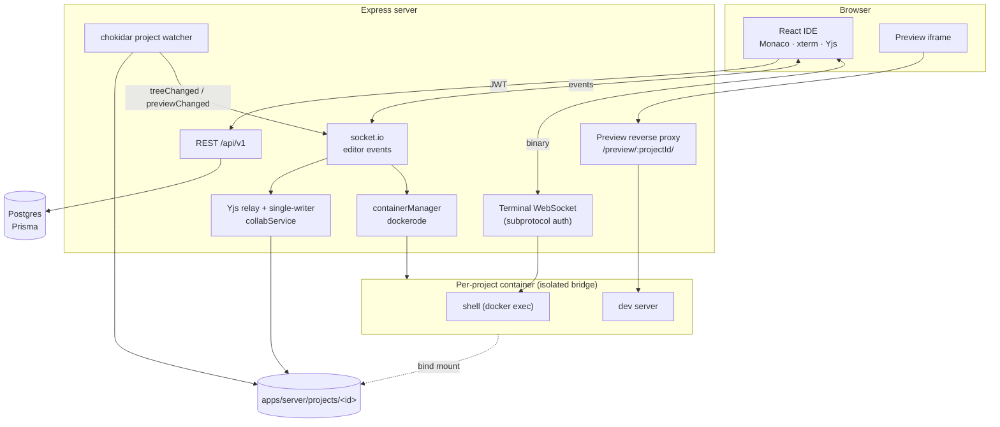

# Replit / CodeSandbox clone — implementation roadmap

_Composed: 2026-08-25. Supersedes `CODEBASE_ANALYSIS.md` (2026-08-22) and
`IMPROVEMENTS.md` (2026-08-22), both of which are carried forward below rather
than discarded._

---

## 0. What this document is, and the one thing it corrects

The brief that produced this roadmap assumed a skeleton project that needed a
sandbox runtime, an editor, a terminal, a preview and collaboration built from
nothing. **That is not this repository.** Every one of those exists, works, and
is tested. Writing a plan that pretended otherwise would have produced fifteen
phases of work that is already merged.

So Phase 0 below is a verification pass — what actually runs, measured, not
assumed — and the phases after it address the gaps that are genuinely still
open. The scope headings from the brief are all answered in §3; most are
answered with "done, here is where it lives".

### Verification performed for this document

| Check | Command | Result |
|---|---|---|
| Install | `pnpm install --frozen-lockfile` | clean, 774 packages |
| Shared build | `pnpm --filter @replit-clone/shared build` | clean |
| Prisma client | `prisma generate` | clean (7.9.1) |
| Typecheck | `pnpm -r typecheck` | **clean, 3/3 packages** |
| Lint | `pnpm -r lint` | **clean, 3/3 packages** |
| Tests | `pnpm -r test` with `TEST_DATABASE_URL` | **1056 passing** — 830 server (56 files) + 226 web (17 files), 0 failing |
| Build | `pnpm --parallel --filter "./apps/*" build` | clean |
| Debt scan | `grep -rn "TODO\|FIXME\|HACK"` over `apps/`, `packages/` | **0 hits** |

Tests were run against a real Postgres 16 started for the purpose, so the
DB-backed tests (refresh-token rotation, replay detection, revocation, sharing)
actually executed rather than skipping.

**No bugs were found.** Not "none worth fixing" — the typecheck, lint, full
suite and build are all green, there is no suppression debt (two
`eslint-disable` lines, both with a stated reason), no `TODO`, no stubbed
function, and no dead code path found by reading. The prior analysis reached the
same conclusion three days earlier and it still holds. The prioritized bug-fix
list the brief asked for is therefore **empty**, and §5 records that honestly
instead of inventing entries to fill it.

---

## 1. Current state

A pnpm monorepo, TypeScript throughout.

```
apps/web        React 19 + Vite 6      the IDE
apps/server     Express + socket.io + dockerode
packages/shared contracts imported by both
images/         sandbox base images (node, python, go)
```

The shared package is load-bearing: the socket event map, REST response shapes
and the file-tree type are declared once, so a renamed event is a compile error
rather than a silent no-op.

### Architecture as built



### Data model (Prisma, 4 migrations applied)

| Model | Purpose | Notable fields |
|---|---|---|
| `User` | account | `email` unique, `passwordHash?`, `githubId?` unique, `emailVerifiedAt?` |
| `UserToken` | reset / verify | `tokenHash` unique, `purpose` enum, `expiresAt`, `usedAt?` |
| `RefreshToken` | revocable sessions | `tokenHash` unique, `familyId`, `revokedAt?` — rotation + replay detection |
| `Project` | workspace | `template`, `ownerId`, `envVars` Json, `shareToken?` unique, `shareRole` |
| `ProjectCollaborator` | sharing | `role` (`VIEWER`/`EDITOR`), unique per (project, user) |

### API surface

**REST** — `/api/v1`

- Auth: `signup`, `login`, `refresh`, `logout`, `me`, `password-reset/{request,confirm}`, `verify-email`, `providers`, `github`, `github/callback`
- Projects: `GET|POST /projects`, `GET /templates`, `PATCH /:id`, `DELETE /:id`, `POST /:id/duplicate`, `GET /:id/{tree,ports,export,env,files}`, `PUT /:id/env`
- Sharing: `GET /:id/sharing`, `PUT /:id/collaborators`, `DELETE /:id/collaborators/:userId`, `POST|DELETE /:id/share-link`, `GET /share/preview`, `POST /share/redeem`
- Git: `GET /:id/git/{status,diff,log}`, `POST /:id/git/{init,stage,unstage,commit}`
- Ops: `GET /ping`, `GET /health`, `GET /metrics`, `GET /ai/status`

**Socket (client → server)** — `readFile`, `writeFile`, `createFile`,
`deleteFile`, `createFolder`, `deleteFolder`, `renameEntry`, `moveEntry`,
`runStart`, `runStop`, `runRestart`, `runSubscribe`, `statsRequest`, `search`,
`replaceInProject`, `docJoin`, `docLeave`, `docSave`, `docUpdate`,
`docAwareness`, `aiAsk`, `aiCancel`

**Socket (server → client)** — `*Success` acknowledgements, `treeChanged`,
`projectAccess`, `docSync`, `docUpdate`, `docAwareness`, `docPeers`, `docSaved`,
`docExternalChange`, `runState`, `runOutput`, `runHistory`, `previewReady`,
`previewChanged`, `previewError`, `previewRecovered`, `containerStats`,
`searchResults`, `replaceResult`

**Terminal** — a separate WebSocket on the same HTTP port; the access token
travels in the WebSocket subprotocol, because a browser cannot set headers on an
upgrade and a query-string token would land in access logs.

---

## 2. Gap analysis vs. Replit / CodeSandbox

Honest scoring of what a user would notice.

| Capability | Replit | Here | Gap |
|---|---|---|---|
| Projects from templates | ✅ | ✅ 12 templates | none |
| Editor (Monaco, tabs, split, search, quick-open) | ✅ | ✅ | command palette, go-to-definition |
| Real shell | ✅ | ✅ PTY over WS, tabbed, multiple per project | side-by-side rather than tabbed |
| Run / stop / restart | ✅ | ✅ + live output, exit codes | none |
| Preview | ✅ | ✅ proxy, auto-reload, HMR-aware | none |
| Multiplayer editing | ✅ | ✅ Yjs CRDT + cursors | none |
| Sharing / permissions | ✅ | ✅ viewer/editor/owner + links | none |
| Container isolation & limits | ✅ | ✅ 512 MB, 0.5 CPU, 256 PID, caps dropped | none |
| Quotas | ✅ | ✅ per-user projects/disk/containers | none |
| Git | ✅ full | ✅ status/stage/commit/log/diff/branches/hunks/discard/remotes/push | push needs an unshared project (see §8) |
| AI assistant | ✅ | ✅ panel + apply-change | none |
| Env vars / secrets | ✅ | ✅ injected, rebuild on change | none |
| Package caching | ✅ | ✅ named cache volume | none |
| Deployment of user apps | ✅ | ◐ static sites | build + publish to a public subdomain; nothing always-on — §8.1 |
| Warm resume / snapshots | ✅ | ◐ | installs are skipped when unchanged; the dev server still reboots — §8.2 |
| Persistent data for user apps | ✅ | ❌ | no DB or KV a project can reach; see §8.3 |
| Package management UI | ✅ | ✅ panel per ecosystem | none |
| Fork / public projects | ✅ | ❌ | no visibility model; see §8.5 |

**Inside the editor, everything a user touches daily is built** — the entry
above this paragraph was written when git was the outstanding item, and git is
now done through push. What remains is the block of rows at the foot of the
table, none of which lives inside the editor: see §8. Diffs went
further than expected: the server computes them (`gitService.diff`), the route
serves them (`GET /:id/git/diff`), the shared response type is declared, and
`getGitDiffApi` is written in the web client — and **no component ever called
it**. The whole chain existed bar its last link, so a source-control panel
listed changed files without being able to show what changed in them.

---

## 3. The brief's fifteen scope areas, answered

1. **Auth & accounts** — done. Argon2, JWT access + rotating hashed refresh
   tokens with family revocation on replay, GitHub OAuth, email verification,
   password reset, per-resource authorization (`service/projectAccessService.ts`).
2. **Projects/workspaces** — done. CRUD, 12 templates, duplicate, rename,
   zip export, share links, listing.
3. **Persistence** — done. Postgres + Prisma, 4 migrations, files on disk under
   `apps/server/projects/<id>`, quota-enforced.
4. **Sandbox runtime** — done. One container per project, 512 MB / 0.5 CPU /
   256 PIDs, all caps dropped, `no-new-privileges`, unprivileged user, isolated
   bridge, 20-minute idle reaper, boot reconciliation of orphans.
5. **Filesystem API** — done. Full CRUD + move + upload/download, all paths
   through one choke point (`utils/projectPaths.ts`) rejecting traversal,
   absolute, Windows/drive-relative forms and NUL bytes. 21 tests on that file
   alone.
6. **Editor** — done bar polish. Monaco, tabs, split panes, dirty state,
   format-on-save, project-wide search **and replace**, quick-open, diff against
   disk, persisted settings. → **Phase 4** added the command palette, and
   **Phase 8** cross-file go-to-definition.
7. **Terminal** — done. Real PTY, resize, 5000-line scrollback, automatic
   reconnect with backoff, and a tab per shell with several per project.
   → **Phase 3** found this already built and pinned it with tests.
8. **Run / stop** — done. Per-template start command, streamed stdout/stderr,
   exit codes, restart, persisted run log.
9. **Preview** — done. Reverse proxy (not a published port), auto-reload on
   save, HMR-socket detection, error/recovery banners, own-origin option.
10. **Realtime collaboration** — done. Yjs per open file, server is sole disk
    writer while a doc is live, presence cursors, peer counts.
11. **Reliability & ops** — done. Structured logs with correlation IDs across
    HTTP *and* sockets, `/health`, `/metrics`, graceful shutdown, boot
    reconciliation, client reconnect, error boundaries.
12. **Security hardening** — done, and documented in `docs/SECURITY.md`.
    Rate limiting, `TRUSTED_PROXY_HOPS`, argv-array exec (no shell anywhere),
    cookie stripping on preview, typed tokens, CSP, 404-not-403 on unauthorized.
13. **Testing & CI** — done. 1056 tests, Playwright E2E, GitHub Actions running
    typecheck/lint/test/build plus a sandbox-image job. → **Phase 5** widens
    coverage to the two untested pages.
14. **Deployment** — done. Dockerfiles, four compose files (dev, prod, Dokploy,
    Dokploy-backend-only), documented env vars, Vercel split-deploy guide.
15. **UX polish** — largely done. → **Phase 6** picks up the remainder.

---

## 4. Assumptions and trade-offs

Recorded because this roadmap was written without asking.

- **I did not rewrite working subsystems.** The brief's phrasing invited
  building a sandbox runtime and collab engine from scratch; both exist and are
  better than a rewrite would be in one pass. Rewriting them would have been
  destruction, not delivery.
- **Git is the priority** because it is the only area where a user hits a wall,
  and because a diff endpoint already exists unused — the cheapest real value in
  the repository.
- **No hunk-level staging in the first git phase.** The existing code comment is
  right: hunk staging needs a patch editor, and half of one is worse than none.
  Phase 2 ships whole-file diffs; hunk staging is deferred to Phase 7.
- **Branch operations stay local.** Push/pull needs credential storage inside a
  sandbox that runs untrusted code — a real security design, not a feature. It
  is scoped in Phase 7 and deliberately not rushed.
- **Deploying user apps to the public internet is out of scope.** It would mean
  running untrusted containers on reachable ports, which contradicts the stated
  security model ("do not expose this to the internet").
- **Docker looked unavailable when this plan was written** — the client was
  present and `/var/run/docker.sock` was not. That was mistaken: the daemon was
  installed and simply not running. Phases 8 and 9 start it, and every
  container-bound flow is exercised for real. Base images cannot be pulled from
  Docker Hub (network policy), but a mirror serves them.

---

## 5. Bug-fix list

**Empty.** See §0. Typecheck, lint, 1056 tests and the build are green; there is
no TODO/FIXME debt and no stub. The two documentation inaccuracies found are
tracked as Phase 1 work, not as bugs:

| Item | Where | Fix |
|---|---|---|
| Test count stale ("291 tests") | `README.md` | 1056 |
| `IMPROVEMENTS.md` #10 lists the orphan sweep as open | `IMPROVEMENTS.md` | `reconcileOnBoot` implements it; mark done |

---

## 6. Phases

Ordered by user-visible value. Each is independently shippable and gets its own
commit.

### Phase 1 — Documentation truth-up ✅
**Goal:** no statement in the repo's docs is false.
- `README.md`: correct the test count; note `pnpm --filter web e2e`.
- `IMPROVEMENTS.md`: close #10 (orphan sweep — `reconcileOnBoot` does it).
- Add this roadmap.
**Acceptance:** every command and count in the README matches observed output.
**Verify:** run each documented command.

### Phase 2 — Git diff view ✅ *(the main gap)*
**Goal:** see what changed in a file, from the source-control panel.
- `utils/parseUnifiedDiff.ts` — new: unified patch → hunks, with both files'
  line numbers resolved. Pure and tested apart from the component, the same
  split `gitService.parseStatus` makes on the server. 13 tests.
- `SourceControlPanel/DiffView.tsx` — new: renders the patch inline, add/delete
  colouring, dual line-number gutters, `+n −n` summary, binary and error states.
  Cancels in-flight requests so a late answer cannot overwrite a newer file.
- `SourceControlPanel.tsx` — a row now expands its diff; the file icon opens the
  file for editing. One diff open at a time; staged and unstaged rows for the
  same file expand independently. 10 tests.
- `getGitDiffApi` needed no work — it already existed, unused.
**Verified:** typecheck, lint, 1079 tests (+23), build — all clean.

### Phase 3 — Multiple terminals ✅ *(already built; pinned with tests)*
**Goal, as planned:** more than one shell per project.
**What was actually found:** already implemented and shipped with the
split-pane work. `BottomPanel` runs a tab per shell, each with its own socket
and PTY; panes are hidden rather than unmounted so a tab switch cannot kill a
shell; the gateway gives every terminal its own id so two on one project are
watched and released separately. `IMPROVEMENTS.md` #7 listing it as open was
stale, and this roadmap inherited that error.

Building it again would have been destructive, so the phase became what the
feature actually lacked — it had **no tests at all**, despite a fiddly tab
lifecycle:
- `BottomPanel.test.tsx` — 12 tests: add/close/switch, panes staying mounted
  across switches (a remount would kill the PTY), renumbering by position so
  closed ids never show as gaps, selection moving off a closed shell, the last
  shell being replaced rather than leaving an empty panel, middle-click close,
  run-start pulling focus to the output, and a viewer getting no shell.
- `IMPROVEMENTS.md` #7 corrected.
**Verified:** typecheck, lint, 1091 tests, build — all clean.

### Phase 4 — Command palette ✅
**Goal, as planned:** command palette and go-to-definition. The palette
shipped; go-to-definition turned out to be a phase of its own and moved to §7.
- `lib/commands.ts` — new: the `Command` shape and `filterCommands`, ranking
  over the existing fuzzy scorer against `"Category: Title"` so "git" reaches
  "Source control: Commit". Disabled commands are kept and greyed with a
  reason rather than hidden — a palette that silently omits "Stop" reads as a
  missing feature. 8 tests.
- `CommandPalette.tsx` — new: same shape as QuickOpen deliberately (modal high
  on the page, one input, arrow navigation), since they are one gesture aimed
  at different things. Closes before running so a command can open its own
  dialog. 12 tests.
- `ProjectPlayground.tsx` — 12 commands wired to the *same* handlers the
  buttons and shortcuts use, never a second copy of the behaviour; Ctrl/Cmd
  +Shift+P registered alongside the existing chords.
- `test/setup.ts` — jsdom ships no `scrollIntoView`; stubbed, since any
  keep-the-row-in-view list calls it from an effect on every render.
**Verified:** typecheck, lint, 1111 tests (+20), build — all clean.

**Why go-to-definition moved:** Monaco creates a model only when a tab is
opened (`EditorComponent.tsx:189`), so its TS worker only ever sees files the
user already has open — cross-file navigation would find nothing. Making it
real needs every project source file in the worker, and the socket API reads
one file per round trip, so it needs a bulk-read event, an invalidation story
for external writes, and a memory budget for large projects. That is a phase,
not a step, and half of it would be worse than none.

### Phase 5 — Test coverage for the two untested pages ✅
**Goal:** `ProjectPlayground.tsx` and `Dashboard.tsx` — the largest untested
surface left, and the two files `CODEBASE_ANALYSIS.md` left open.
- `Dashboard.test.tsx` — 12 tests: listing, opening a card, filtering by name
  *and* template, case/whitespace handling, ordering by last activity rather
  than creation, delete-behind-a-confirmation, duplicate, share, create, and
  staying put when create fails.
- `ProjectPlayground.test.tsx` — 21 tests: layout toggles and their
  persistence, sidebar view switching, every hotkey (including Ctrl+P and
  Ctrl+Shift+P not claiming each other's chord), the palette's run commands
  against live run state, a viewer being refused, and both banners.
  Monaco/xterm/preview are stood in for; the socket is a fake whose captured
  handlers deliver `projectAccess` the way the server does.
**Verified:** typecheck, lint, 1144 tests (+33), build — all clean.

Two things the tests had to be taught rather than assume: react-query hands a
mutation function a context argument beside the variable, and access level is
null until the server announces it, so a page rendered without that event is
correctly read-only.

### Phase 6 — Remaining polish ✅ *(partly; one item deliberately not done)*
- **Per-app READMEs** ✅ (`IMPROVEMENTS.md` #8). `apps/server/README.md` and
  `apps/web/README.md`: layout, the three things to know before changing
  anything, how to run the tests, and pointers to `CONTRIBUTING.md` and
  `docs/SECURITY.md`. Every structural and behavioural claim in them was
  checked against the code — one draft assertion ("container tests use a faked
  docker client") was wrong and was corrected: the tests use hand-built
  stand-ins typed as dockerode's `Container`, and `containerManager.ts`'s own
  Docker calls remain covered only by the E2E suite.
- **Monaco chunking** ✅ *already done*. `vite.config.ts` already splits monaco,
  xterm, antd and react-icons into their own chunks, with
  `chunkSizeWarningLimit` set just above Monaco so the warning still fires if
  anything else grows that large. Monaco is ~4 MB self-hosted and behind the
  lazy playground route; there is nothing further worth doing. The roadmap
  listed this without checking — corrected.
- **E2E specs** — deferred here, then written and run in Phases 8 and 9. The
  reasoning at the time ("a test that has never passed is a claim, not
  coverage") stands; the premise did not. The daemon was not missing, only
  unstarted. See the correction at the end of Phase 9.

### Phase 7 — Git branches ✅
The deferred item whose design question turned out to have a defensible answer,
so it was built rather than left.

**The two hazards, and what was decided:**
- *Dirty worktree.* git is permissive — it carries uncommitted changes across
  when they do not conflict. In an editor where those files are also open in
  other people's tabs, that means edits silently follow you onto another branch
  and get committed there. `switchBranch` refuses unless the worktree is clean
  and says why.
- *Live shared documents.* A switch rewrites files under anyone with the
  project open, and a live Yjs document still holding the old branch's text
  would write it back over the new one. The controller calls `forgetProject`
  after a successful switch — the same move the search-and-replace path already
  makes — so every editor reloads from disk. It is called only on success, so a
  refused switch costs nobody their buffer.

**Shipped:** `parseBranches` + `branches`/`createBranch`/`switchBranch`/
`assertValidBranchName` in `gitService.ts`; `GET /git/branches` and
`POST /git/branch` (viewer to list, editor to change); shared `GitBranch`
types; a branch picker and a new-branch dialog in the panel, with viewers
getting the plain label they had before.

Also fixed on the way through: the panel reported git's refusals as "Request
failed with status code 400", losing the server's actual message — which for
these is the entire point. `reasonFrom` now reads `{ message }` off the error
body, which improves stage, unstage and commit failures too.

**Two real bugs caught before they shipped**, both in git argument order:
`git checkout -- <name>` treats the name as a *pathspec*, so it would have
tried to discard a file rather than switch branch; and `check-ref-format
--branch -- <name>` is a usage error that rejects every name. Verified against
a real git repository, and corrected to `checkout <name> --` and
`check-ref-format --branch <name>`. The leading-dash guard is what keeps
dropping that separator safe.

**Verified:** typecheck, lint, 1169 tests (+25), build — all clean.

### Phase 8 — Still deferred, deliberately
Each needs a design decision rather than an afternoon.
- **Git remotes** — push/pull/clone. Blocked on credential storage for a
  container running untrusted code. Needs a threat model first.
- **Hunk-level staging** — needs a patch editor (see §4).
- **Cross-file go-to-definition** — needs the project's sources in Monaco's TS
  worker: a bulk-read socket event, invalidation on external writes, and a
  memory budget. See Phase 4 for why it is not a one-liner.
- **Discard / revert changes** — destructive; needs confirmation UX and an
  interaction story with live Yjs documents.

---

## 7. Progress

- [x] Phase 0 — verification (green across the board, no bugs)
- [x] Phase 1 — documentation truth-up
- [x] Phase 2 — git diff view
- [x] Phase 3 — multiple terminals (already built; pinned with tests)
- [x] Phase 4 — command palette
- [x] Phase 5 — page test coverage
- [x] Phase 6 — remaining polish (E2E revisited in Phase 8)
- [x] Phase 7 — git branches
- [x] Phase 8 — discard, hunk staging, go-to-definition, remotes, E2E
- [x] Phase 9 — git push (owner-only, unshared projects) and the container-bound E2E flow

---

## 8. What is still missing against Replit and CodeSandbox

_Added 2026-08-26. §2 scores the capabilities a user touches inside the editor,
and by that measure the product is essentially complete: templates, editor,
shell, run, preview, multiplayer, sharing, isolation, quotas, git through push,
the assistant, secrets, package caching, cross-file TS intelligence and a
problems panel are all built._

_This section scores the things that are missing at a level above the editor —
where the remaining distance to both competitors actually is. None of these is
an afternoon; each is listed with the decision it is blocked on rather than
being written up as though it were ready to start._

### 8.1 Deployment of user apps — static deployments done

_Updated 2026-08-26. The entry below is kept because the framing still holds:
this is the line between an editor and a product, and only the first slice of it
is built._

Replit sells Deployments (autoscale, reserved VM, static, scheduled) with a
custom domain on each. CodeSandbox gives every branch a live preview URL.

The preview proxy was the only way to see a running project: it requires a
session, it serves a *dev* server, and the container behind it is stopped after
`CONTAINER_IDLE_MINUTES`. Nothing built here could be shown to somebody without
an account.

**Done — static deployments.** `service/deployService.ts` runs the template's
build inside the project's container, copies the output tree out to
`DEPLOYMENTS_DIR`, and `deploySite.ts` serves it from a third origin at a
generated subdomain — `quiet-fern-84f1.<DEPLOY_ORIGIN host>` — with no session,
no cookie parser, and no container behind it. It covers the Vite templates, the
Next templates (which the deploy build switches into `output: 'export'` mode),
and Static HTML. The address is stable across redeploys, so a link already
handed out keeps working.

Three things carry the weight and are worth naming, because each is a way this
could have been quietly wrong:

- **A third origin, not the preview's.** A published site is arbitrary user code
  and must not be same-origin with the API. Less obviously it must not share the
  *preview* origin either: a preview is authenticated by a cookie scoped to that
  origin, so a public site beside it would be same-origin with a page carrying a
  live preview credential.
- **The copy is the security boundary.** `copyTree` is hand-written rather than
  `fs.cp` because it has to refuse symlinks outright — a link to `/etc/passwd`
  in a build output, copied verbatim into a directory served publicly and
  unauthenticated, is a file disclosure with no further steps — enforce a byte
  budget as it goes, and confine every destination path.
- **The build environment is corrected, not inherited.** `PREVIEW_BASE` is what
  makes a dev server serve under `/preview/<id>/`, and Vite bakes it into every
  asset URL at build time. A build that inherited it would produce a site whose
  scripts all point at a path that does not exist on the deploy origin.

**Still open:** everything that needs a process at request time. Express, Flask,
FastAPI and Go projects are told plainly that there is nothing static to
publish. Always-on compute, autoscale, and scheduled jobs are a different
product with a different cost model — a long-lived container on this host, or a
handoff to Fly/Railway/Cloudflare — and that decision has not been made.

**Also open:** custom domains. A deployment host needs a wildcard DNS record
and, over HTTPS, a wildcard certificate. Locally that costs nothing, because
browsers resolve every `*.localhost` name to loopback themselves; a real
deployment has to arrange both, and `.env.example` says so.

### 8.2 Warm containers / snapshots — partly done

_Corrected 2026-08-26. The first version of this entry said the reaper removes
an idle container and the next open therefore re-runs `npm install`. Half of
that was wrong: `startIdleReaper` calls `stop`, not `remove`, and
`startContainer` has always reused a stopped container. `node_modules` lives in
the bind mount and outlives the container altogether. The waiting was real; the
explanation was not._

What actually cost the time: every template's start command begins with its
install step, so opening a project re-ran a full dependency resolution against
dependencies that were already installed — and with `AUTO_START_ON_OPEN` on,
that was the price of merely looking at a project.

**Done:** `containers/warmStart.ts` fingerprints the manifests and lockfiles,
stamps the fingerprint inside the container once a run reaches `running`, and
skips the install half of the start command when the two match and the
artefacts are still present. Every uncertainty resolves towards installing; a
command that cannot be split with certainty — including any run command a user
wrote — runs whole. `runs_install_skipped` counts the skips.

**Still open,** and this is the part that is genuinely CodeSandbox's feature:
the dev server process itself still dies with the container and has to boot
again. A memory snapshot that resumes a running process is a different
mechanism from anything here, and needs a decision about how much disk a
suspended project may hold.

### 8.3 Persistent data for user apps

Replit gives every repl a key-value store and a Postgres database. A project
here gets a bind-mounted working tree and nothing else: no database a user's
app can talk to, no object storage, no runtime state that survives the reaper.

- **Blocked on:** isolation. The platform's own Postgres must never be
  reachable from a container running untrusted code, so this means either a
  per-project database with generated credentials injected as env vars, or a
  small KV service on the sandbox network with per-project tokens.
- **Designed in full** in `VSCODE_PARITY_PLAN.md` §7, which works the above
  through to a sidecar container per project, adds Postgres and MongoDB
  templates, and splits off the in-editor query editor and table browser as a
  feature that ships first and needs none of this infrastructure.

### 8.4 Package management UI

Both competitors let a user search for and add a dependency without opening a
terminal, with version pinning and a visible dependency list. Here it is `npm
install` typed into a shell, and nothing in the UI knows what the project
depends on.

- **Blocked on:** nothing. This is the most self-contained item in the section:
  parse the manifest the template already ships (`package.json`,
  `requirements.txt`, `go.mod`), render it, and drive add/remove through the
  package manager inside the container using the run-command plumbing that
  already exists.

### 8.5 Fork, and the idea of a public project

Neither product's central social mechanic exists here, because the concept it
rests on does not: there is no such thing as a public project. Duplicate copies
a project you already own; share invites a named collaborator. Taking a
stranger's project, getting your own copy, and needing no permission to do it
is what makes a template gallery or a shared tutorial link work at all.

- **Blocked on:** a visibility model on `Project` and its consequences —
  abuse (public projects are a spam and malware surface), quota accounting for
  a fork, and whether secrets and git remotes are stripped on copy. The last
  one is a security requirement, not a nicety.

### 8.6 Smaller, and each genuinely smaller

- **Language servers beyond TypeScript.** The TS worker now has the project's
  sources, so go-to-definition works for JS and TS. The Python and Go templates
  get syntax highlighting and nothing else — no diagnostics from the real
  toolchain, no completion, no rename.
- **Always-on workers and scheduled jobs.** Replit runs both. Everything here
  is tied to an interactive session and dies with it.
- **A CLI, and local sync.** No way to work against a project from a local
  editor.
- **Follow-mode.** Presence shows who is here and which file they are in;
  it does not let you ride along with their viewport.
- **Checkpoint history outside git.** Replit's per-keystroke history recovers a
  file from before the first commit. Here, an uncommitted mistake is gone.

### 8.7 Suggested order

By leverage, and by how little each depends on a decision that has not been
made yet:

1. ~~**8.4 packages**~~ — done.
2. ~~**8.2 warm containers**~~ — done as far as the install step goes; process
   snapshots remain.
3. ~~**8.1 static deployments**~~ — done. Always-on compute and custom domains
   remain, and both are blocked on a cost decision rather than on work.
4. **8.3 persistent data**, then **8.5 fork** — both need a design round first.
