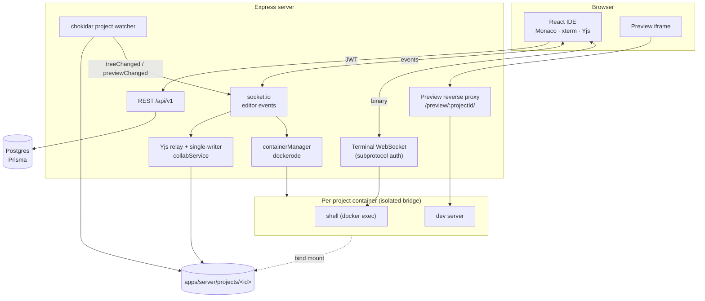

# Replit / CodeSandbox clone — implementation roadmap

_Composed: 2026-08-25. Supersedes `CODEBASE_ANALYSIS.md` (2026-08-22) and
`IMPROVEMENTS.md` (2026-08-22), both of which are carried forward below rather
than discarded._

---

## 0. What this document is, and the one thing it corrects

The brief that produced this roadmap assumed a skeleton project that needed a
sandbox runtime, an editor, a terminal, a preview and collaboration built from
nothing. **That is not this repository.** Every one of those exists, works, and
is tested. Writing a plan that pretended otherwise would have produced fifteen
phases of work that is already merged.

So Phase 0 below is a verification pass — what actually runs, measured, not
assumed — and the phases after it address the gaps that are genuinely still
open. The scope headings from the brief are all answered in §3; most are
answered with "done, here is where it lives".

### Verification performed for this document

| Check | Command | Result |
|---|---|---|
| Install | `pnpm install --frozen-lockfile` | clean, 774 packages |
| Shared build | `pnpm --filter @replit-clone/shared build` | clean |
| Prisma client | `prisma generate` | clean (7.9.1) |
| Typecheck | `pnpm -r typecheck` | **clean, 3/3 packages** |
| Lint | `pnpm -r lint` | **clean, 3/3 packages** |
| Tests | `pnpm -r test` with `TEST_DATABASE_URL` | **1056 passing** — 830 server (56 files) + 226 web (17 files), 0 failing |
| Build | `pnpm --parallel --filter "./apps/*" build` | clean |
| Debt scan | `grep -rn "TODO\|FIXME\|HACK"` over `apps/`, `packages/` | **0 hits** |

Tests were run against a real Postgres 16 started for the purpose, so the
DB-backed tests (refresh-token rotation, replay detection, revocation, sharing)
actually executed rather than skipping.

**No bugs were found.** Not "none worth fixing" — the typecheck, lint, full
suite and build are all green, there is no suppression debt (two
`eslint-disable` lines, both with a stated reason), no `TODO`, no stubbed
function, and no dead code path found by reading. The prior analysis reached the
same conclusion three days earlier and it still holds. The prioritized bug-fix
list the brief asked for is therefore **empty**, and §5 records that honestly
instead of inventing entries to fill it.

---

## 1. Current state

A pnpm monorepo, TypeScript throughout.

```
apps/web        React 19 + Vite 6      the IDE
apps/server     Express + socket.io + dockerode
packages/shared contracts imported by both
images/         sandbox base images (node, python, go)
```

The shared package is load-bearing: the socket event map, REST response shapes
and the file-tree type are declared once, so a renamed event is a compile error
rather than a silent no-op.

### Architecture as built



### Data model (Prisma, 4 migrations applied)

| Model | Purpose | Notable fields |
|---|---|---|
| `User` | account | `email` unique, `passwordHash?`, `githubId?` unique, `emailVerifiedAt?` |
| `UserToken` | reset / verify | `tokenHash` unique, `purpose` enum, `expiresAt`, `usedAt?` |
| `RefreshToken` | revocable sessions | `tokenHash` unique, `familyId`, `revokedAt?` — rotation + replay detection |
| `Project` | workspace | `template`, `ownerId`, `envVars` Json, `shareToken?` unique, `shareRole` |
| `ProjectCollaborator` | sharing | `role` (`VIEWER`/`EDITOR`), unique per (project, user) |

### API surface

**REST** — `/api/v1`

- Auth: `signup`, `login`, `refresh`, `logout`, `me`, `password-reset/{request,confirm}`, `verify-email`, `providers`, `github`, `github/callback`
- Projects: `GET|POST /projects`, `GET /templates`, `PATCH /:id`, `DELETE /:id`, `POST /:id/duplicate`, `GET /:id/{tree,ports,export,env,files}`, `PUT /:id/env`
- Sharing: `GET /:id/sharing`, `PUT /:id/collaborators`, `DELETE /:id/collaborators/:userId`, `POST|DELETE /:id/share-link`, `GET /share/preview`, `POST /share/redeem`
- Git: `GET /:id/git/{status,diff,log}`, `POST /:id/git/{init,stage,unstage,commit}`
- Ops: `GET /ping`, `GET /health`, `GET /metrics`, `GET /ai/status`

**Socket (client → server)** — `readFile`, `writeFile`, `createFile`,
`deleteFile`, `createFolder`, `deleteFolder`, `renameEntry`, `moveEntry`,
`runStart`, `runStop`, `runRestart`, `runSubscribe`, `statsRequest`, `search`,
`replaceInProject`, `docJoin`, `docLeave`, `docSave`, `docUpdate`,
`docAwareness`, `aiAsk`, `aiCancel`

**Socket (server → client)** — `*Success` acknowledgements, `treeChanged`,
`projectAccess`, `docSync`, `docUpdate`, `docAwareness`, `docPeers`, `docSaved`,
`docExternalChange`, `runState`, `runOutput`, `runHistory`, `previewReady`,
`previewChanged`, `previewError`, `previewRecovered`, `containerStats`,
`searchResults`, `replaceResult`

**Terminal** — a separate WebSocket on the same HTTP port; the access token
travels in the WebSocket subprotocol, because a browser cannot set headers on an
upgrade and a query-string token would land in access logs.

---

## 2. Gap analysis vs. Replit / CodeSandbox

Honest scoring of what a user would notice.

| Capability | Replit | Here | Gap |
|---|---|---|---|
| Projects from templates | ✅ | ✅ 12 templates | none |
| Editor (Monaco, tabs, split, search, quick-open) | ✅ | ✅ | command palette, go-to-definition |
| Real shell | ✅ | ✅ PTY over WS | **one terminal only** — no split/tabs |
| Run / stop / restart | ✅ | ✅ + live output, exit codes | none |
| Preview | ✅ | ✅ proxy, auto-reload, HMR-aware | none |
| Multiplayer editing | ✅ | ✅ Yjs CRDT + cursors | none |
| Sharing / permissions | ✅ | ✅ viewer/editor/owner + links | none |
| Container isolation & limits | ✅ | ✅ 512 MB, 0.5 CPU, 256 PID, caps dropped | none |
| Quotas | ✅ | ✅ per-user projects/disk/containers | none |
| Git | ✅ full | ⚠️ status/stage/commit/log | **no diff UI, no branches, no remotes, no discard** |
| AI assistant | ✅ | ✅ panel + apply-change | none |
| Env vars / secrets | ✅ | ✅ injected, rebuild on change | none |
| Package caching | ✅ | ✅ named cache volume | none |
| Deployment of user apps | ✅ | ❌ | out of scope (see §6) |

**The gap is git.** Everything else a user touches daily is built. The server
already computes diffs (`gitService.diff`, `GET /:id/git/diff`) — and the web
app never calls it. That is the single largest visible hole: a source-control
panel that lists changed files but cannot show what changed in them.

---

## 3. The brief's fifteen scope areas, answered

1. **Auth & accounts** — done. Argon2, JWT access + rotating hashed refresh
   tokens with family revocation on replay, GitHub OAuth, email verification,
   password reset, per-resource authorization (`service/projectAccessService.ts`).
2. **Projects/workspaces** — done. CRUD, 12 templates, duplicate, rename,
   zip export, share links, listing.
3. **Persistence** — done. Postgres + Prisma, 4 migrations, files on disk under
   `apps/server/projects/<id>`, quota-enforced.
4. **Sandbox runtime** — done. One container per project, 512 MB / 0.5 CPU /
   256 PIDs, all caps dropped, `no-new-privileges`, unprivileged user, isolated
   bridge, 20-minute idle reaper, boot reconciliation of orphans.
5. **Filesystem API** — done. Full CRUD + move + upload/download, all paths
   through one choke point (`utils/projectPaths.ts`) rejecting traversal,
   absolute, Windows/drive-relative forms and NUL bytes. 21 tests on that file
   alone.
6. **Editor** — done bar polish. Monaco, tabs, split panes, dirty state,
   format-on-save, project-wide search **and replace**, quick-open, diff against
   disk, persisted settings. → **Phase 4** adds command palette + go-to-definition.
7. **Terminal** — done bar multiplexing. Real PTY, resize, 5000-line scrollback,
   automatic reconnect with backoff. → **Phase 3** adds multiple terminals.
8. **Run / stop** — done. Per-template start command, streamed stdout/stderr,
   exit codes, restart, persisted run log.
9. **Preview** — done. Reverse proxy (not a published port), auto-reload on
   save, HMR-socket detection, error/recovery banners, own-origin option.
10. **Realtime collaboration** — done. Yjs per open file, server is sole disk
    writer while a doc is live, presence cursors, peer counts.
11. **Reliability & ops** — done. Structured logs with correlation IDs across
    HTTP *and* sockets, `/health`, `/metrics`, graceful shutdown, boot
    reconciliation, client reconnect, error boundaries.
12. **Security hardening** — done, and documented in `docs/SECURITY.md`.
    Rate limiting, `TRUSTED_PROXY_HOPS`, argv-array exec (no shell anywhere),
    cookie stripping on preview, typed tokens, CSP, 404-not-403 on unauthorized.
13. **Testing & CI** — done. 1056 tests, Playwright E2E, GitHub Actions running
    typecheck/lint/test/build plus a sandbox-image job. → **Phase 5** widens
    coverage to the two untested pages.
14. **Deployment** — done. Dockerfiles, four compose files (dev, prod, Dokploy,
    Dokploy-backend-only), documented env vars, Vercel split-deploy guide.
15. **UX polish** — largely done. → **Phase 6** picks up the remainder.

---

## 4. Assumptions and trade-offs

Recorded because this roadmap was written without asking.

- **I did not rewrite working subsystems.** The brief's phrasing invited
  building a sandbox runtime and collab engine from scratch; both exist and are
  better than a rewrite would be in one pass. Rewriting them would have been
  destruction, not delivery.
- **Git is the priority** because it is the only area where a user hits a wall,
  and because a diff endpoint already exists unused — the cheapest real value in
  the repository.
- **No hunk-level staging in the first git phase.** The existing code comment is
  right: hunk staging needs a patch editor, and half of one is worse than none.
  Phase 2 ships whole-file diffs; hunk staging is deferred to Phase 7.
- **Branch operations stay local.** Push/pull needs credential storage inside a
  sandbox that runs untrusted code — a real security design, not a feature. It
  is scoped in Phase 7 and deliberately not rushed.
- **Deploying user apps to the public internet is out of scope.** It would mean
  running untrusted containers on reachable ports, which contradicts the stated
  security model ("do not expose this to the internet").
- **Docker is unavailable in the environment this plan was written in** (client
  present, no daemon). Container-touching code cannot be executed here, so those
  paths are verified by unit tests with a faked docker client, as the repo
  already does. Anything needing a live daemon is called out per phase.

---

## 5. Bug-fix list

**Empty.** See §0. Typecheck, lint, 1056 tests and the build are green; there is
no TODO/FIXME debt and no stub. The two documentation inaccuracies found are
tracked as Phase 1 work, not as bugs:

| Item | Where | Fix |
|---|---|---|
| Test count stale ("291 tests") | `README.md` | 1056 |
| `IMPROVEMENTS.md` #10 lists the orphan sweep as open | `IMPROVEMENTS.md` | `reconcileOnBoot` implements it; mark done |

---

## 6. Phases

Ordered by user-visible value. Each is independently shippable and gets its own
commit.

### Phase 1 — Documentation truth-up ✅
**Goal:** no statement in the repo's docs is false.
- `README.md`: correct the test count; note `pnpm --filter web e2e`.
- `IMPROVEMENTS.md`: close #10 (orphan sweep — `reconcileOnBoot` does it).
- Add this roadmap.
**Acceptance:** every command and count in the README matches observed output.
**Verify:** run each documented command.

### Phase 2 — Git diff view *(the main gap)*
**Goal:** see what changed in a file, from the source-control panel.
- `apps/web/src/apis/projects.ts` — add `getGitDiffApi` (endpoint exists).
- `apps/web/src/components/organisms/SourceControlPanel/DiffView.tsx` — new:
  parse unified diff, render hunks with add/delete colouring and line numbers.
- `SourceControlPanel.tsx` — click a changed file → diff; staged vs unstaged.
- Tests: diff parser (hunk headers, +/-/context, renames, binary, empty).
**Depends on:** nothing. **Verify:** `pnpm -r test`, `typecheck`, `lint`.

### Phase 3 — Multiple terminals
**Goal:** more than one shell per project.
- `BottomPanel` gains terminal tabs: add, close, switch.
- `BrowserTerminal` keyed per session so each owns its socket and scrollback.
- Server: confirm `terminalGateway` admits concurrent execs per project and that
  detach accounting stays balanced when one of several closes.
**Depends on:** Phase 2 only for commit order. **Verify:** tests + manual.

### Phase 4 — Editor polish
**Goal:** command palette and go-to-definition.
- Command palette (Ctrl/Cmd-Shift-P) over the existing `QuickOpen` fuzzy scorer,
  listing real commands (run, stop, save, format, toggle panels, git refresh).
- Monaco TS worker definition provider wired for in-project navigation.
**Verify:** tests for the command registry and fuzzy ranking.

### Phase 5 — Test coverage for the two untested pages
**Goal:** `ProjectPlayground.tsx` (629 lines) and `Dashboard.tsx` (560) get
direct tests — the largest untested surface left.
- Render with mocked socket + API; cover tab open/close, unsaved-work guard,
  access-level downgrade, run-state transitions, project create/delete/rename.
**Verify:** `pnpm --filter web test`.

### Phase 6 — Remaining polish
- Per-app READMEs (`apps/web`, `apps/server`) pointing at `CONTRIBUTING.md` and
  `docs/SECURITY.md` (`IMPROVEMENTS.md` #8).
- E2E specs for save→preview-reload and EDITOR share-link redemption (#9).
- Monaco chunk is 4 MB; evaluate `manualChunks` splitting by language worker.

### Phase 7 — Deferred, deliberately
Not attempted in this pass; each needs a design decision rather than an
afternoon.
- **Git branches** — list/create/switch/merge. Mechanically easy; the question
  is what happens to a dirty worktree and live shared documents on switch.
- **Git remotes** — push/pull/clone. Blocked on credential storage for a
  container running untrusted code. Needs a threat model first.
- **Hunk-level staging** — needs a patch editor (see §4).
- **Discard / revert changes** — destructive; needs confirmation UX and an
  interaction story with live Yjs documents.

---

## 7. Progress

- [x] Phase 0 — verification (green across the board, no bugs)
- [x] Phase 1 — documentation truth-up
- [ ] Phase 2 — git diff view
- [ ] Phase 3 — multiple terminals
- [ ] Phase 4 — editor polish
- [ ] Phase 5 — page test coverage
- [ ] Phase 6 — remaining polish
- [ ] Phase 7 — deferred (branches, remotes, hunk staging, discard)
